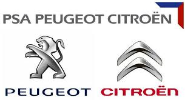

## Introductions

- Hello! I am Guillaume Morini ([@GuillaumeMorini])
   - I have worked at PSA Peugeot Citroën , PMU 🏇, Cisco , Docker 🐳, VMware and Google Cloud 

- The training will run for 4 hours, with a 30 minutes break in the middle

- Feel free to interrupt for questions at any time. 
  - *Especially when you see full screen container pictures!*

- Use @@CHAT@@ to ask questions, get help, etc.

[@GuillaumeMorini]: https://twitter.com/GuillaumeMorini

---

## Exercises

- During the sessions, there are exercises

- To make the most out of the training, please try the exercises!

  (it will help to practice and memorize the content of the day)

- We recommend to take at least one hour to work on the exercises

  (if you understood the content of the day, it will be much faster)

- Each session will start with a quick review of the exercises of the previous session
